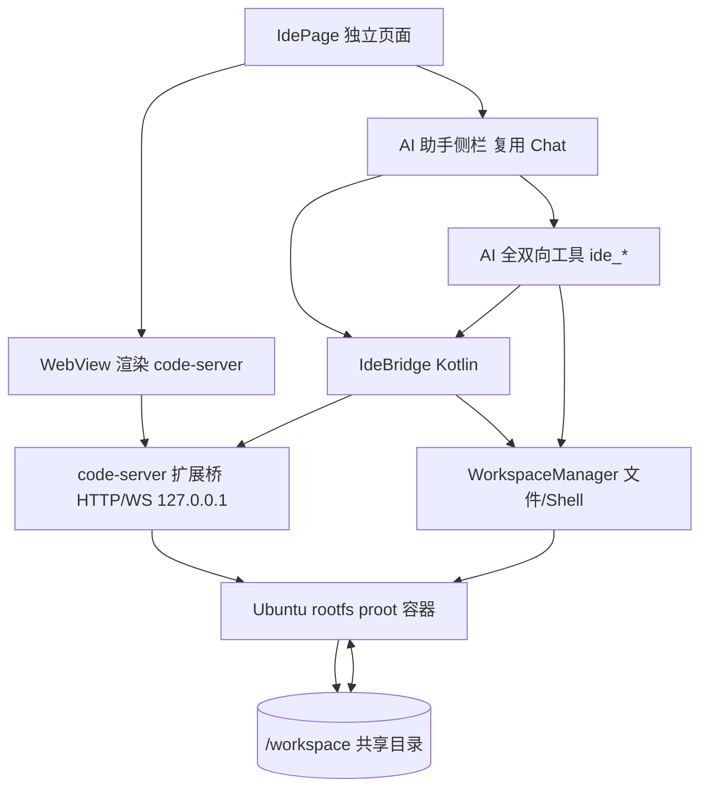

## 产品概述

在 RikkaLLM 中新增一个独立的「IDE 页面」，以 VS Code 式布局（活动栏 + 资源管理器 + 编辑器 + AI 助手侧栏）呈现，编辑器由 code-server（Coder 出品的网页版 VS Code）经 WebView 渲染，底层运行在 RikkaLLM 既有 proot 沙箱（Ubuntu Noble rootfs）中。AI 助手复用原项目的对话能力，可直接识别项目文件、读写改文件、在编辑器内打开、在集成终端运行命令，并感知活动文件与诊断，形成「对话驱动编码」闭环。

## 核心功能

- 独立 IDE 页面：VS Code 式三栏布局（宽屏）/ 编辑器全屏 + 抽屉式助手（窄屏），侧边栏挂原项目 AI 助手。
- 真 VS Code 编辑体验：code-server 渲染进 WebView，含语法高亮、智能补全、集成终端、文件树。
- 多架构支持：同时支持 arm64-v8a 与 x86_64（含模拟器），引擎二进制打包进 APK/AAB。
- AI 全双向联动：自动列出/识别项目文件、读/写/改文件、在编辑器打开文件、在终端执行命令、获取活动文件与诊断信息。
- 共享文件系统：工作区目录 bind-mount 进 Ubuntu 容器 `/workspace`，AI 工具与编辑器看到同一份文件，改动实时互映。
- 离线可用：首次进入 IDE 时从 APK assets 按当前 ABI 释放 code-server 与 Ubuntu rootfs 到工作区并启动。

## 技术栈

- 语言/UI：Kotlin + Jetpack Compose（沿用现有工程）。
- 沙箱底座：复用 `workspace` 模块（已含 arm64-v8a 与 x86_64 的 proot 原生库、`ProotShellRunner`、`RootfsInstaller`、`WorkspaceManager`）。
- 编辑器内核：code-server 4.103.1（Coder，linux-arm64 / linux-x64 官方构建）+ Ubuntu Noble rootfs，由 assets 离线分发。
- 桥接：WebView（`app` 现有 `WebView.kt`）注入 JS 桥脚本 + rootfs 内置轻量 VS Code 扩展，经 `127.0.0.1` 本地 HTTP/WS 互通。
- AI 工具：扩展现有 `WorkspaceTools.kt` 工具集（`Tool`/`InputSchema` 体系）。

## 实现方案

1. **多架构二进制打包**：在 `app/src/arm64-v8a/assets/` 与 `app/src/x86_64/assets/` 各放对应架构的 `code-server-*.tar.gz` 与 `ubuntu-noble-*.tar.xz`（proot 库已存在于 `workspace/src/main/jniLibs` 双架构）。启用 AAB 的 ABI 拆分（默认开启），使每个 ABI 变体仅含本架构 assets+libs；本地 universal 调试 APK 会同时含两套（约 +360MB），发布用 AAB。
2. **首启安装器（复用既有体系）**：新增 `IdeRuntimeInstaller`，首次进入 IDE 时按 `Build.SUPPORTED_ABIS` 选 ABI，从 assets 读取归档流，复用 `RootfsInstaller.extractTar`（已支持 tar.gz/tar.xz 与符号链接）把 Ubuntu rootfs 释放到 `linuxDir`、把 code-server 释放到 rootfs 内 `/opt/code-server`，并部署桥接扩展到 `~/.vscode-server/extensions`。
3. **启动 code-server（复用 proot）**：通过 `WorkspaceManager.executeCommand` 在 proot 内执行 `code-server --bind-addr 127.0.0.1:8080 --auth none /workspace`。`ProotShellRunner` 已默认把 `filesDir` bind-mount 到容器 `/workspace`，故 AI 与编辑器天然共享文件，无需额外挂载。
4. **双向桥**：

- rootfs 内桥接扩展：启动本地 HTTP API（复用 code-server 自带 node），端点 `openFile`/`runInTerminal`/`getActiveEditor`/`getDiagnostics`，并订阅编辑器事件回推。
- Kotlin 侧 `IdeBridge`：`HttpURLConnection`/`OkHttp` 调用上述端点（AI 工具用），并通过 `WebView.addJavascriptInterface` + 注入脚本（延续 Code FA `code_lfa_mods.js` 的键盘修饰符伪造思路，并叠加 `postMessage`→`AndroidBridge` 转发编辑器事件）接收事件。

5. **AI 全双向工具**：在 `WorkspaceTools.kt` 现有 `workspace_read/write/edit_file`、`workspace_shell` 基础上，新增 `ide_list_project_files`（`WorkspaceManager.glob/listFiles`）、`ide_open_in_editor`、`ide_run_in_terminal`、`ide_get_active_file`、`ide_get_diagnostics`，全部走 `IdeBridge` + 工作区文件 API，并复用既有审批/安全区（`/workspace`、`/tmp`）机制。
6. **独立 IDE 页面**：将 `IdePane.kt` 重构为独立目的地 `IdePage.kt`（VS Code 式：左活动栏/资源管理器、中编辑器 WebView、右 AI 助手侧栏复用现有 Chat 组件，绑定一个工作区感知会话）。宽屏三栏、窄屏编辑器全屏 + 底部抽屉助手。在 `RouteActivity.kt` 的 `Screen` 密封接口新增 `data object Ide : Screen` 并注册主底部导航入口。

## 实现要点

- **不重复造轮子**：直接复用 `ProotShellRunner` 的 `/workspace` 绑定与 `RootfsInstaller.extractTar`；新增的只是「从 assets 释放」与「启动 code-server/部署扩展」两处。
- **安全**：code-server `--auth none` 仅绑定 `127.0.0.1`，WebView 仅允许 `localhost` 请求（`WebViewLocalAssets.intercept` 已拦截本地资源）；桥接 HTTP 仅监听回环地址。
- **体积与架构**：AAB 按 ABI 拆分 assets（源集 `src/<abi>/assets/`）；`app/build.gradle.kts` 明确开启 `bundle.abi.enableSplit`（默认）并说明 universal 调试包体积。
- **性能**：rootfs/code-server 释放为一次性首启操作，带进度与「未安装运行时」提示；编辑器与终端运行在 proot 子进程，UI 线程仅做 WebView 渲染与桥消息转发，避免阻塞。

## 架构设计



## 目录结构

```
app/src/main/java/com/ninef/rikkallm/
├── RouteActivity.kt                      # [MODIFY] Screen 密封接口新增 Ide；注册导航图与底部导航入口
├── ui/pages/ide/
│   ├── IdePage.kt                        # [NEW] 独立 IDE 页（活动栏+资源管理器+编辑器+AI 侧栏），VS Code 式布局
│   ├── IdePane.kt                        # [MODIFY] 重构：复用 IdeActionBar/OutputPanel，启动走 IdeRuntimeInstaller，接入 IdeBridge
│   └── components/
│       ├── ActivityBar.kt                # [NEW] 左侧活动栏（资源管理器/搜索/终端/助手切换）
│       ├── FileExplorer.kt               # [NEW] 资源管理器，列出 /workspace 项目文件
│       └── AiAssistantSidebar.kt         # [NEW] 右侧 AI 助手栏，复用现有 Chat 组件并绑定工作区会话
├── ui/components/webview/WebView.kt      # [MODIFY] 支持注入桥脚本与 addJavascriptInterface 事件通道（onCreated 钩子）
└── data/ai/tools/
    ├── WorkspaceTools.kt                 # [MODIFY] 新增 ide_list_project_files/open_in_editor/run_in_terminal/get_active_file/get_diagnostics
    └── IdeBridge.kt                      # [NEW] code-server 桥 HTTP 客户端 + 编辑器事件回调接口

workspace/src/main/java/me/rerere/workspace/
├── IdeRuntimeInstaller.kt                # [NEW] 按 ABI 从 assets 释放 code-server+Ubuntu rootfs，部署桥扩展，启动 code-server
└── RootfsInstaller.kt                    # [MODIFY] 新增 installFromAsset(root, assetName, onProgress) 复用 extractTar

app/src/arm64-v8a/assets/                 # [NEW] code-server-linux-arm64.tar.gz + ubuntu-noble-aarch64.tar.xz + 桥扩展
app/src/x86_64/assets/                    # [NEW] code-server-linux-x64.tar.gz + ubuntu-noble-x86_64.tar.xz + 桥扩展
app/build.gradle.kts                      # [MODIFY] 配置 ABI 源集与 AAB ABI 拆分说明
workspace/src/test/.../IdeRuntimeInstallerTest.kt  # [NEW] 资产映射/释放单元测试
```

## 关键接口（桥接契约）

```
// IdeBridge.kt —— Kotlin 侧调用 rootfs 内 VS Code 扩展暴露的本地 HTTP API
interface IdeBridge {
    suspend fun openInEditor(path: String, line: Int? = null)      // POST /openFile
    suspend fun runInTerminal(command: String, cwd: String = "/workspace"): String // POST /runTerminal
    suspend fun getActiveFile(): String?                           // GET  /activeEditor
    suspend fun getDiagnostics(path: String): List<Diagnostic>     // GET  /diagnostics
    fun setOnEditorEvent(callback: (EditorEvent) -> Unit)          // WebView JS -> AndroidBridge
}
```

IDE 页面采用「原生 Compose 外壳 + WebView(code-server HTML 客户端)」的混合架构。整体视觉语言对齐 VS Code：深色为主、左侧细活动栏、资源管理器树、中央编辑器、右侧 AI 助手栏。编辑器区域本身是 code-server 的 Web UI（Monaco），外围导航/侧栏用 Jetpack Compose + Material 3，随应用主题自适应。宽屏三栏（活动栏+编辑器+助手），窄屏编辑器全屏、AI 助手以底部抽屉唤出。交互强调动态感：活动栏图标选中高亮、文件树展开微动画、助手指示器流式响应、编辑器加载进度条。