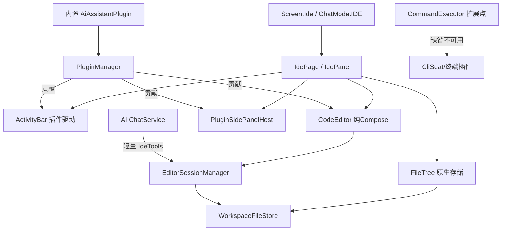

## 用户需求

用户明确要求：移除所有与开源 code-server / VSCode 相关的源码与运行时依赖，自行研发一款轻量级 IDE 编辑器，保证极致的轻量化与良好的用户体验，并预留可扩展的插件系统接口，便于后续社区方案接入。

## 产品概述

将 RikkaLLM 当前基于 code-server（运行在 proot + Ubuntu rootfs 中、经 WebView 渲染）的「类 VSCode」能力，重写为一个完全自研的纯 Compose 轻量代码编辑器。同步移除 180MB 的 ide-runtime 资产与 proot/rootfs 沙箱，用原生文件存储（应用内部存储 + SAF 导入导出）替代，使编辑器能直接读写工作区真实文件。新增插件系统，以扩展点 + PluginManager + 内置示例插件的方式为社区预留集成入口。

## 核心特性

- 删除全部 code-server / VSCode 源码、桥接扩展、ide-runtime 与 ide-bridge 资产及获取脚本
- 移除 proot/rootfs 运行时，workspace 模块瘦身为数据类 + 原生 WorkspaceFileStore
- 纯 Compose 自研代码编辑器：行号、语法高亮、撤销/重做、查找替换、多标签页、脏标记
- 轻量文件树：懒加载、基于原生存储，无沙箱开销
- 插件系统：SidePanelContributor / EditorActionContributor / FileActionContributor / CompletionProvider / LanguageSupportProvider / DiagnosticProvider / CommandExecutor 等扩展点，PluginManager 支持内置编译期注册并预留动态加载接口
- AI 双向工具轻量化：open_in_editor / get_active_file / get_diagnostics 基于 EditorSessionManager + 原生存储；run_in_terminal 经 CommandExecutor 扩展点（缺省不可用、友好提示）
- 内置示例插件：将「AI 助手侧栏」实现为内置插件，验证扩展点可落地，为社区提供同构接入范式

## 技术栈

- 语言/框架：Kotlin + Jetpack Compose（Material3 / Material3 Expressive），与现有 app 模块一致
- DI：Koin（沿用 RepositoryModule / appModule 等现有模块组织）
- 语法高亮：复用现有 `highlight` 模块（纯 Kotlin 实现，按语言/扩展名产出高亮区间或 AnnotatedString）
- 存储：应用内部存储目录（`context.filesDir/workspaces/<id>/files/...`）+ SAF（`DocumentFile`/`OpenDocumentTree`）导入导出
- 并发：`Dispatchers.IO` + 协程，沿用 `withContext`/`runInterruptible` 模式

## 实现策略（含已决疑点）

实施前自主审查并提出以下疑点，均已解决：

1. **是否要删除 proot/rootfs 沙箱？** —— 是。该沙箱是 code-server 的运行宿主，且 `WorkspaceRepository` 当前所有文件 I/O（listFiles/readText/writeText/importFile/exportFile/executeCommand）均经 `WorkspaceManager(proot)`，FILES 区也存于 rootfs 内。保留它将使「轻量自研编辑器」自相矛盾。方案：删除 proot/rootfs 类，新建原生 `WorkspaceFileStore`，编辑器直接读写工作区真实文件。
2. **AI 的 workspace_shell / CliSeat（依赖 proot 执行 CLI）如何处理？** —— 核心移除 proot 命令执行；将「命令执行」抽象为插件扩展点 `CommandExecutor`。终端/CLI 席位作为社区插件回归，核心缺省时给出友好「不可用」提示，绝不崩溃。
3. **能否复用既有代码？** —— 复用 `highlight` 模块做语法高亮、复用 workspace 模块数据类（`Workspace`/`WorkspaceFileEntry`/`WorkspaceStorageArea`/`WorkspaceShellStatus`/`WorkspaceCommandResult`）。将 workspace 模块瘦身为「仅数据类 + WorkspaceFileStore」，移除 `WorkspaceManager`/`RootfsInstaller`/`ProotShellRunner`/`RootfsPatcher`/`WorkspaceBindMount`。
4. **编辑器是否仍用 WebView？** —— 否。采用 `BasicTextField` + 自定义行号/高亮渲染层，纯 Compose，彻底去掉 `IdeWebView` 与 ide-runtime 资产。

## 性能与可靠性

- `WorkspaceFileStore` 为本地 `File` I/O，无 proot 进程与 tar 解包开销；大目录列表采用懒加载与层级展开，避免一次性扫描整棵树。
- 编辑器对大文件（>1MB）采用只读高亮 + 分页/懒渲染策略，防止单次重组卡顿；编辑态使用增量文本状态与撤销栈。
- 插件系统惰性初始化，内置插件在 Koin 启动时注册，动态加载接口默认关闭并以清单约定（`assets/plugins` 或外部目录）预留，避免启动阻塞与未知代码执行风险。
- 移除 180MB 资产后单架构 APK 体积显著下降，符合极致轻量化目标。

## 架构设计



## 目录结构

```
workspace/src/main/java/me/rerere/workspace/
├── WorkspaceFileStore.kt            # [NEW] 原生文件存储：基于 filesDir/workspaces/<id>/files，提供 list/read/write/import/export/delete/move，纯 File I/O，无 proot
├── Workspace.kt / WorkspaceFileEntry.kt / WorkspaceStorageArea.kt / WorkspaceShellStatus.kt / WorkspaceCommandResult.kt  # [KEEP] 数据类与枚举（移除 proot 相关字段/方法）
└── (删除) WorkspaceManager.kt / RootfsInstaller.kt / ProotShellRunner.kt / RootfsPatcher.kt / WorkspaceBindMount.kt

app/src/main/java/com/ninef/rikkallm/
├── data/repository/WorkspaceRepository.kt     # [MODIFY] 改为依赖 WorkspaceFileStore；删除 rootfs/executeCommand/LINUX 区逻辑，仅保留 FILES 区
├── data/ai/tools/WorkspaceTools.kt            # [MODIFY] read/write/edit 走原生存储相对路径；移除 workspace_shell 或改走 CommandExecutor 扩展点
├── data/ai/tools/IdeTools.kt                  # [DELETE] 旧 IdeBridge 版；新增轻量版见 data/editor
├── data/cliseat/CliSeatRunner.kt              # [MODIFY] 移除 proot 依赖，改走 CommandExecutor 扩展点（缺省不可用）
├── data/cliseat/CliSeatConfig.kt              # [MODIFY] 注释与执行路径改为扩展点
├── data/provider/WorkspaceDocumentsProvider.kt# [MODIFY] 改用 WorkspaceFileStore
├── service/ChatService.kt                      # [MODIFY] 移除 createIdeTools(IdeBridge)，注册轻量 IdeTools；保留 WorkspaceTools
├── ui/pages/chat/ChatPage.kt                   # [MODIFY] ChatMode.IDE 内嵌新 IdePane
├── RouteActivity.kt                            # [MODIFY] Screen.Ide 路由到新 IdePage
├── ui/pages/extensions/workspace/WorkspaceDetailPage.kt  # [MODIFY] 保留「打开 IDE」入口
├── RikkaHubApp.kt                              # [MODIFY] 移除 ideModule，加入 editorModule/pluginModule
├── di/RepositoryModule.kt                      # [MODIFY] WorkspaceRepository 去掉 manager/rootfsInstaller，注入 WorkspaceFileStore
├── di/IdeModule.kt                             # [DELETE] 由 editorModule/pluginModule 替代
├── data/ide/                                   # [DELETE] IdeRuntimeInstaller/IdeBridge/IdeCompletion*
├── data/editor/EditorSessionManager.kt        # [NEW] 管理标签页、活动文件、脏标记、内容缓冲；AI 工具与插件读写编辑器的桥梁
├── data/editor/completion/CompletionProvider.kt # [NEW] 补全扩展点 + 内置片段补全（无 LSP）
├── data/plugin/IdePlugin.kt                    # [NEW] 插件接口（id/name/initialize）
├── data/plugin/PluginManager.kt               # [NEW] 注册表：内置编译期注册 + 动态加载预留接口
├── data/plugin/extensions/*.kt                 # [NEW] 各扩展点接口（SidePanel/EditorAction/FileAction/Completion/LanguageSupport/Diagnostic/CommandExecutor）
├── data/plugin/builtin/AiAssistantPlugin.kt   # [NEW] 内置示例插件（演示 SidePanel + EditorAction）
├── ui/pages/ide/IdePage.kt                     # [NEW] ActivityBar + FileTree + CodeEditor + 侧栏
├── ui/pages/ide/IdePane.kt                     # [NEW] 供 ChatPage 内嵌的轻量版
├── ui/pages/ide/components/ActivityBar.kt      # [NEW] 由插件贡献的面板/动作驱动
├── ui/pages/ide/components/FileTree.kt         # [NEW] 懒加载原生存储文件树
├── ui/pages/ide/components/CodeEditor.kt       # [NEW] 行号 + 高亮 + 编辑 + 撤销/重做 + 查找
├── ui/pages/ide/components/PluginSidePanelHost.kt  # [NEW] 渲染插件贡献的侧面板
├── assets/ide-runtime/ 与 assets/ide-bridge/   # [DELETE] 约 180MB 资产
└── (删除) scripts/fetch-ide-runtime.ps1, app/src/test/.../data/ide/*, VSCodroid-main/
```

## 关键代码结构（接口契约）

扩展点与插件管理为核心契约，以下为接口级定义（不含实现体）：

```
interface IdePlugin {
    val id: String
    val name: String
    fun initialize(context: PluginContext)
}

interface PluginManager {
    fun register(plugin: IdePlugin)
    fun sidePanels(): List<SidePanelContributor>
    fun editorActions(): List<EditorActionContributor>
    fun fileActions(): List<FileActionContributor>
    fun completionProviders(): List<CompletionProvider>
    fun commandExecutor(): CommandExecutor?
}

interface SidePanelContributor {
    val id: String
    val title: String
    @Composable fun Content(workspaceId: String?, session: EditorSessionManager)
}

interface EditorActionContributor {
    val id: String
    val label: String
    fun onInvoke(session: EditorSessionManager)
}

interface CommandExecutor {
    suspend fun execute(command: String, cwd: String): WorkspaceCommandResult
}
```

`EditorSessionManager` 提供 `openFile(workspaceId, path)`、`activeFile`、`isDirty`、`readBuffer()`/`writeBuffer()` 等，作为编辑器 UI、AI 工具与插件的统一会话面。

## 设计风格

采用 Material3 Expressive 的轻量编辑器风格：极简、低干扰、高可读性。深色为主、浅色可选，强调代码区专注度。ActivityBar 用窄竖条图标导航（文件树/侧栏），编辑区为带行号的纯文本画布，语法高亮以柔和语义色区分。侧栏面板（如 AI 助手）以底部抽屉或右滑面板呈现，避免遮挡代码。所有交互加入微动效（标签切换、面板展开、保存反馈），保证良好移动端体验。

## 页面规划（IDE 页）

1. 顶部：工作区名 + 打开文件标签栏（可横向滚动、脏标记圆点、关闭按钮）
2. 左侧：ActivityBar 窄竖条（文件树/侧栏切换，由插件贡献）
3. 中部：CodeEditor（行号 + 语法高亮 + 查找栏）；无文件时为空状态引导
4. 右侧/底部：PluginSidePanelHost（渲染插件侧栏，如 AI 助手）
5. 底部：状态栏（光标行列、编码、文件大小、保存状态）

## Agent Extensions

### SubAgent

- **code-explorer**
- Purpose: 在删除 code-server/proot 源码后，跨多文件验证是否残留对 `IdeBridge`/`WorkspaceManager`/`RootfsInstaller`/`IdeModule` 等符号的引用，定位需改造的调用点
- Expected outcome: 产出完整残留引用清单，确保删除与改造无遗漏、编译可控

### Skill

- **lsp-code-analysis**
- Purpose: 在改造 `WorkspaceRepository`/`WorkspaceTools`/`CliSeatRunner` 等去 proot 依赖时，用语义分析确认类型与调用关系，辅助安全替换
- Expected outcome: 确认替换后的符号引用一致，避免隐藏的编译/运行时错误